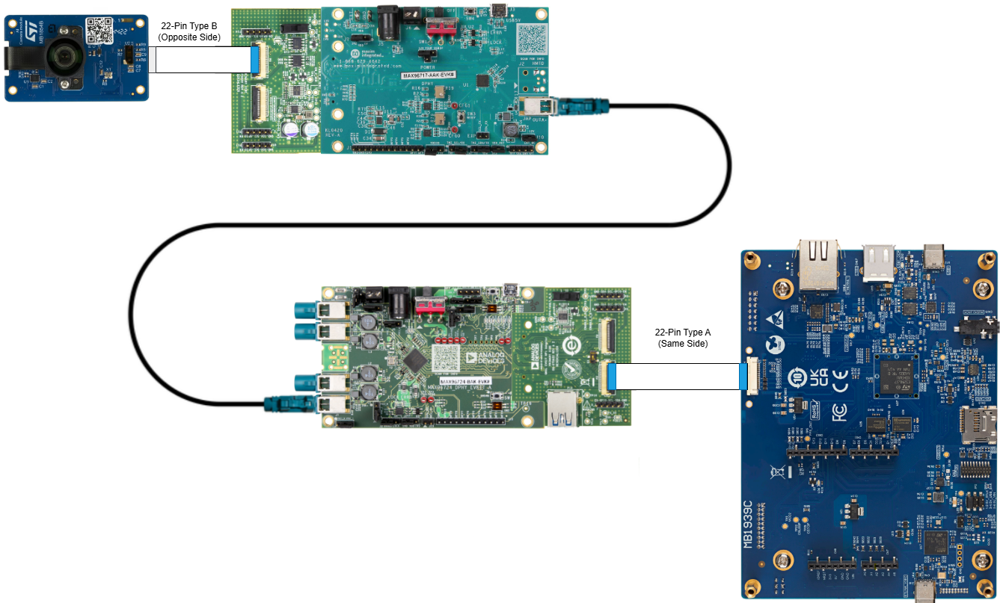

# Hardware Setup

The hardware setup for this application is *similiar* to the Raspberry PI use case
found on the [AD-GMSLCAMRPI-ADP - Using with Raspberry Pi](https://analogdevicesinc.github.io/documentation/solutions/reference-designs/ad-gmslcamrpi-adp/raspberry-pi-user-guide/index.html)
documentation.  This documentation may be used as a refernce for jumper and switch
locations as well as general hardware setup.

> **Use the tables below for specific jumper settings for this application as they may be slightly
different.**

## Hardware Modifications

Minor modifications of the GMSL evaluation kits are required to support the adapter
board usage and STM32 specific camera configuration.

### MAX96717F-AAK

Solder bridge or install a 0 Ohm resistor on the following reference designators:

| REFDES | Description |
| ------ | ----------- |
| R70    | Provides 12VDC to the Adapter board |
| R80    | Connect MFP2 to the sensor interface connector |
| R66    | Provides VDDIO to the Adapter board |

### MAX96724F-BAK

Solder bridge or install a 0 Ohm resistor on the following reference designators:

| REFDES | Description |
| ------ | ----------- |
| R88    | Provides VDDIO to the Adapter board |
| R89    | Connect MFP5 to the sensor interface connector |
| R91    | Connect MFP0 to the sensor interface connector |

## Bootstrap Configurations

The GMSL evaluation kits feature digipots to set the bootstrap pins for specific
configuration parameters.  Utilize the GMSL GUI, available on the [MAX97624F](https://www.analog.com/en/products/max96724F.html) and
[MAX96717F](https://www.analog.com/en/products/max96717F.html) product landing pages to configure these pins.

### MAX96717F-AAK

| CFG | Value | Description |
| --- | ----- | ----------- |
| CFG0 | 0 | I2C, ROR, Addr 0x80 |
| CFG1 | 5 | Coax, 6Gbps, Tunnel |

### MAX96724F-AAK

| CFG | Value | Description |
| --- | ----- | ----------- |
| CFG0 | 0 | I2C, Addr 0x4E |
| CFG1 | 0 | Coax, 6Gbps, GMSL2 |

## Switch and Jumper Settings

The follow tables describes the switch and jumper settings for each board. All
switches and jumpers not listed in the tables below utilize the defaults as
shipped, and described in the respective User's Guides.

### MAX96717F-AAK

| REFDES | Position | Description |
| ------ | -------- | ----------- |
| J10    | CLOSED   | Enabled Power over Coax |

#### Serializer Adapter Board

| REFDES | Position | Description |
| ------ | -------- | ----------- |
| S2     | CAM1     | Enable CAM1 (P9) |

### MAX96724F-BAK

| REFDES | Position | Description |
| ------ | -------- | ----------- |
| J3     | 2-3      | Enable POC  |
| SW5    | ON-ON    | Enable I2C to Adapter |

#### Deserializer Adapter Board

| REFDES | Position | Description |
| ------ | -------- | ----------- |
| S1     | CAM2     | Enable CAM2 (P6) |
| S3     | P6       | Slide towards P6. Enable 3.3V on CAM2 |

## Hardware Interconnect

| Connector A | Connector B | Description |
| ----------- | ----------- | ----------- |
| ST CAM CN1 | Serializer Adapter P9 | 22-Pin Type B Ribbon |
| MAX96717F-AAK OUTA | MAX96724F-BAK INA | FAKRA Coax Cable (Provided in Kits) |
| Deserializer Adapter P6 | STM32N6570-DK CN14 | 22-Pin Type A Ribbon |
| MAX96724F-BAK J13 | | 12VDC Power Adapter (Provided in Kits) |
| STM32N6570-DK CN6 (STLink) | Development PC | USB-C Flash & Terminal |

Below is an illustration of the hardware interconnection for this application. In
addition to the connections shown below, a 12VDC adapter is needed for the
MAX96724F-BAK Deserializer (provided with the Kit) and a USB-C cable between the
STM32 `STLINK` connection and your PC for flashing and terminal output.

